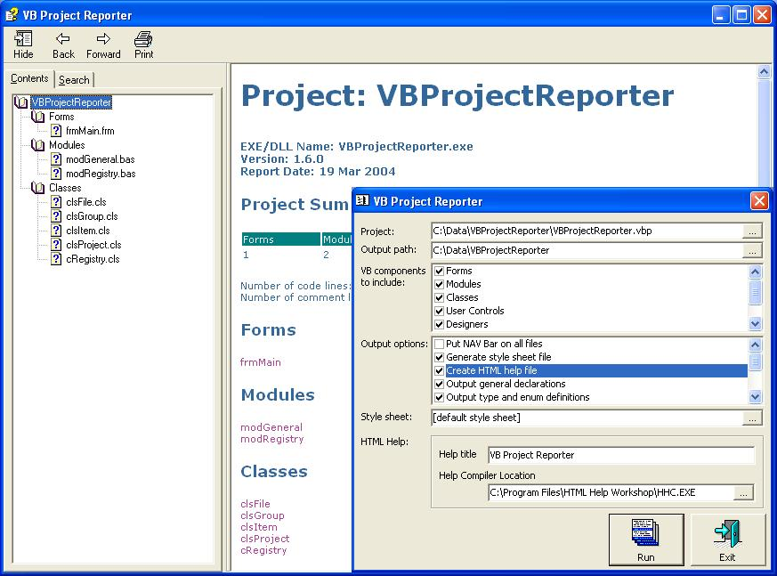



## VB Project Reporter

### Description

This is the latest version of the VB Project Reporter, a source code documentation generation program originally written by 'kerlin'. I have now added support for all the VB document types (.vbg, .vbp, .bas, .cls, .frm, .ctl, .dob, .dsr, .pag). Also new in this version: documentation for form/module level declarations (variables and constants), types, enums and API declares; comment lines at the beginning of a file are included in documentation, as well as comment lines preceding and following sub/function definition; total code and comment lines are tallied; more version information from the project file is included; procedure attributes are now included, where defined for a procedure; an expanded interface allows all components to be switched on or off. Output is to HTML with style sheet controls, and optionally (if the Microsoft HTML Help Workshop software is installed) the program can generate HTML Help files (.chm). The style sheet can be overridden if required. The program has been re-written to use classes. I'd appreciate some constructive comments about the code, along with any ideas for new features. And if anyone knows how to extract meaningful information from a .res file before it is compiled into a VB program, I'll add more detailed info on resource files to the documentation. The program uses a registry class written by Steve McMahon (www.vbaccelerator.com). Thanks to 'Eugene', 'Adrian' and 'PROBRO' for the suggestions implemented in this version. Bug Fix: Corrected some out of bounds and Type Mismatch errors. Updated 31 Aug 2004: Fixed a couple of small bugs.
 
### More Info
 

             |
---                |---
**Submitted On**   |2004-08-11 11:40:30
**By**             |[Nick Rogers](https://github.com/Planet-Source-Code/PSCIndex/blob/master/ByAuthor/nick-rogers.md)
**Level**          |Intermediate
**User Rating**    |5.0 (90 globes from 18 users)
**Compatibility**  |VB 6\.0
**Category**       |[Complete Applications](https://github.com/Planet-Source-Code/PSCIndex/blob/master/ByCategory/complete-applications__1-27.md)
**World**          |[Visual Basic](https://github.com/Planet-Source-Code/PSCIndex/blob/master/ByWorld/visual-basic.md)
**Archive File**   |[VB\_Project1787748302004\.zip](https://github.com/Planet-Source-Code/nick-rogers-vb-project-reporter__1-52403/archive/master.zip)

